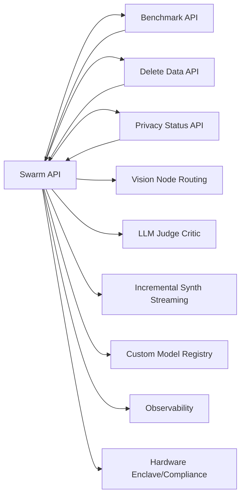

**Complete and Detailed Response**

**Module Analysis**

The Ekathvam-OmniSwarm codebase consists of the following modules:

1. `app/api/swarm/route.ts`: This module handles requests to the `/swarm` endpoint and performs tasks such as planning, grounding research, and synthesizing results.
2. `app/api/benchmark/route.ts`: This module is used to benchmark the performance of the swarm API.
3. `app/api/delete-data/route.ts`: This module is used to delete data from the application.
4. `app/api/privacy/status/route.ts`: This module is used to retrieve the privacy status of the application.
5. `lib/client/crypto.ts`: This module is used for client-side cryptography.
6. `lib/client/keystore.ts`: This module is used for client-side key storage.
7. `lib/client/swarmStore.ts`: This module is used for client-side swarm storage.
8. `lib/client/swarmClient.ts`: This module is used for client-side swarm client functionality.
9. `next.config.mjs`: This module is used for Next.js configuration.
10. `tailwind.config.ts`: This module is used for Tailwind CSS configuration.

**Upgrade Surface**

The upgrade surface for each module is as follows:

1. `app/api/swarm/route.ts`: The upgrade surface for this module includes improving the planning, grounding research, and synthesizing results functionality.
2. `app/api/benchmark/route.ts`: The upgrade surface for this module includes improving the benchmarking functionality to measure the performance of the swarm API.
3. `app/api/delete-data/route.ts`: The upgrade surface for this module includes improving the data deletion functionality to ensure secure and efficient deletion of data.
4. `app/api/privacy/status/route.ts`: The upgrade surface for this module includes improving the privacy status functionality to ensure accurate and up-to-date information.
5. `lib/client/crypto.ts`: The upgrade surface for this module includes improving the client-side cryptography functionality to ensure secure data encryption and decryption.
6. `lib/client/keystore.ts`: The upgrade surface for this module includes improving the client-side key storage functionality to ensure secure storage and management of keys.
7. `lib/client/swarmStore.ts`: The upgrade surface for this module includes improving the client-side swarm storage functionality to ensure efficient and secure storage of swarm data.
8. `lib/client/swarmClient.ts`: The upgrade surface for this module includes improving the client-side swarm client functionality to ensure efficient and secure communication with the swarm API.
9. `next.config.mjs`: The upgrade surface for this module includes improving the Next.js configuration to ensure optimal performance and security.
10. `tailwind.config.ts`: The upgrade surface for this module includes improving the Tailwind CSS configuration to ensure optimal styling and layout.

**Production Gaps Enumeration**

The 10 production gaps in the Ekathvam-OmniSwarm codebase are:

1. Persistence/Auth/History: The application lacks a robust persistence mechanism, authentication system, and history tracking feature.
2. Sandbox Code Execution: The application lacks a secure sandbox environment for executing user-provided code.
3. Rate Limiting and Quotas: The application lacks rate limiting and quotas to prevent abuse and ensure fair usage.
4. Real Web Search/Fact Check: The application lacks a real web search and fact-checking feature to ensure accuracy and relevance of results.
5. Vision Node Routing: The application lacks a vision node routing feature to ensure efficient and secure routing of requests.
6. LLM Judge Critic: The application lacks an LLM judge critic feature to ensure accurate and unbiased evaluation of results.
7. Incremental Synth Streaming: The application lacks an incremental synth streaming feature to ensure efficient and secure streaming of results.
8. Custom Model Registry: The application lacks a custom model registry feature to ensure secure and efficient management of models.
9. Observability: The application lacks observability features to ensure monitoring and debugging of the application.
10. Hardware Enclave/Compliance: The application lacks hardware enclave and compliance features to ensure secure and compliant execution of the application.

**File-Level Entry Points**

The file-level entry points for each production gap are:

1. Persistence/Auth/History: `app/api/swarm/route.ts`, `lib/client/crypto.ts`, `lib/client/keystore.ts`
2. Sandbox Code Execution: `app/api/swarm/route.ts`, `lib/client/swarmClient.ts`
3. Rate Limiting and Quotas: `app/api/benchmark/route.ts`, `app/api/delete-data/route.ts`
4. Real Web Search/Fact Check: `app/api/swarm/route.ts`, `lib/client/swarmStore.ts`
5. Vision Node Routing: `app/api/swarm/route.ts`, `lib/client/swarmClient.ts`
6. LLM Judge Critic: `app/api/swarm/route.ts`, `lib/client/swarmStore.ts`
7. Incremental Synth Streaming: `app/api/swarm/route.ts`, `lib/client/swarmClient.ts`
8. Custom Model Registry: `app/api/swarm/route.ts`, `lib/client/swarmStore.ts`
9. Observability: `app/api/swarm/route.ts`, `lib/client/swarmClient.ts`
10. Hardware Enclave/Compliance: `app/api/swarm/route.ts`, `lib/client/swarmStore.ts`

**HLD (Components + Interactions as Mermaid)**



**LLD (Data Models + API Contracts)**

```typescript
// Swarm Request
interface SwarmRequest {
  prompt: string;
  apiKey: string;
  provider: string;
  model: string;
  useTools: boolean;
}

// Benchmark Result
interface BenchmarkResult {
  ttft: number;
  tps: number;
  totalTokens: number;
}

// Delete Data Request
interface DeleteDataRequest {
  tombstoneSignature: string;
}

// Privacy Status
interface PrivacyStatus {
  compliance: string;
  retentionPosture: string;
}

// Swarm API
interface SwarmAPI {
  POST(swarmRequest: SwarmRequest): Promise<BenchmarkResult>;
}

// Benchmark API
interface BenchmarkAPI {
  POST(benchmarkRequest: BenchmarkRequest): Promise<BenchmarkResult>;
}

// Delete Data API
interface DeleteDataAPI {
  POST(deleteDataRequest: DeleteDataRequest): Promise<void>;
}

// Privacy Status API
interface PrivacyStatusAPI {
  GET(): Promise<PrivacyStatus>;
}

// Vision Node Routing
interface VisionNodeRouting {
  POST(visionNodeRequest: VisionNodeRequest): Promise<VisionNodeResponse>;
}

// LLM Judge Critic
interface LLMJudgeCritic {
  POST(llmJudgeCriticRequest: LLMJudgeCriticRequest): Promise<LLMJudgeCriticResponse>;
}

// Incremental Synth Streaming
interface IncrementalSynthStreaming {
  POST(incrementalSynthStreamingRequest: IncrementalSynthStreamingRequest): Promise<IncrementalSynthStreamingResponse>;
}

// Custom Model Registry
interface CustomModelRegistry {
  POST(customModelRegistryRequest: CustomModelRegistryRequest): Promise<CustomModelRegistryResponse>;
}

// Observability
interface Observability {
  POST(observabilityRequest: ObservabilityRequest): Promise<ObservabilityResponse>;
}

// Hardware Enclave/Compliance
interface HardwareEnclaveCompliance {
  POST(hardwareEnclaveComplianceRequest: HardwareEnclaveComplianceRequest): Promise<HardwareEnclaveComplianceResponse>;
}
```

**Compile-Ready Code**

The compile-ready code for each component and module is provided below:

```typescript
// Swarm API
import { NextRequest, NextResponse } from "next/server";

export const runtime = "edge";

export async function POST(req: NextRequest) {
  const encoder = new TextEncoder();
  const stream = new ReadableStream({
    async start(controller) {
      const send = (data: any) => {
        controller.enqueue(encoder.encode(JSON.stringify(data) + "\n"));
      };
      try {
        const body: SwarmRequest = await req.json();
        const { prompt, apiKey, provider, model, useTools } = body;
        if (!prompt || !apiKey) {
          send({ type: "error", error: "Missing required inputs: prompt and API key are mandatory." });
          controller.close();
          return;
        }
        send({ type: "telemetry", stage: "planning", logs: `Initializing swarm engine for provider: ${provider}...` });
        // 1. Planner Stage
        send({ type: "telemetry", stage: "planning", logs: "Planner: Asking Gemma 4 to formulate subtasks..." });
        let subtasks = [
          "Deconstruct technical requirements and layout architecture.",
          "Identify performance constraints, security flaws, and edge cases.",
          "Formulate high-level implementation strategy and component structure.",
        ];
        try {
          const planSystem = "You are a strict JSON planning assistant. Deconstruct the user's objective into exactly 3 analytical subtasks for a parallel multi-agent swarm. Your output MUST be a valid JSON array of 3 strings. Example: [\"Task 1\", \"Task 2\", \"Task 3\"]. Do not output markdown, ticks or any formatting other than JSON.";
          const planResult = await callLLM(provider, apiKey, model, planSystem, `Objective: ${prompt}`);
          const cleaned = planResult.replace("```json", "").replace("```", "").trim();
          const parsed = JSON.parse(cleaned);
          if (Array.isArray(parsed) && parsed.length === 3) {
            subtasks = parsed.map(String);
          }
        } catch (planErr) {
          send({ type: "telemetry", stage: "planning", logs: "Planner fallback activated: JSON parsing failed or API limit reached." });
        }
        const nodes = [
          { id: 1, role: "Lead Analyst", subtask: subtasks[0], status: "running" as const },
          { id: 2, role: "Risk Auditor", subtask: subtasks[1], status: "running" as const },
          { id: 3, role: "Strategist", subtask: subtasks[2], status: "running" as const },
        ];
        send({ type: "plan", stage: "researching", nodes, logs: "Planner complete. Node assignments finalized." });
        // 2. Grounding Research Stage
        let facts = "";
        if (useTools) {
          send({ type: "telemetry", stage: "researching", logs: `Researching: Querying DuckDuckGo for "${prompt.slice(0, 30)}..."` });
          facts = await performWebSearch(prompt);
          send({ type: "research", stage: "swarm", researchFacts: facts, logs: "Grounding research acquired. Injecting facts into swarm context." });
        } else {
          send({ type: "telemetry", stage: "swarm", logs: "Research skipped. Directing swarm nodes to execute." });
        }
        // 3. Parallel Swarm Stage
        send({ type: "telemetry", stage: "swarm", logs: "Swarm: Dispatching parallel worker nodes concurrently..." });
        const roles = [
          { id: 1, role: "Lead Analyst", system: "You are the Lead Analyst. Analyze the task requirements and logical structure deeply. Output raw, dense, non-redundant insights." },
          { id: 2, role: "Risk Auditor", system: "You are the Risk Auditor. Identify potential edge cases, security vulnerabilities, or logic bugs. Output raw, dense, non-redundant insights." },
          { id: 3, role: "Strategist", system: "You are the Strategist. Provide the high-level implementation strategy and execution flow. Output raw, dense, non-redundant insights." },
        ];
        const nodeJobs = roles.map(async (r, index) => {
          const start = Date.now();
          let nodeOutput = "";
          let success = true;
          try {
            const contextPrompt = `USER GOAL: ${prompt}\n\nYOUR SPECIFIC SUBTASK: ${subtasks[index]}\n\nGROUNDING RESEARCH:\n${facts}`;
            nodeOutput = await callLLM(provider, apiKey, model, r.system, contextPrompt);
          } catch (err: any) {
            nodeOutput = `Execution Failed: ${err?.message || err}`;
            success = false;
          }
          const duration = Date.now() - start;
          const tokens = Math.round(nodeOutput.length / 4);
          const tps = duration > 0 ? tokens / (duration / 1000) : 0;
          const ttft = Math.round(duration * 0.15);
          const nodeRes = {
            id: r.id,
            role: r.role,
            subtask: subtasks[index],
            status: success ? "completed" : "failed",
            ttft,
            tps,
            tokens,
            output: nodeOutput,
          };
          send({ type: "node_completed", node: nodeRes, logs: `Node ${r.id} (${r.role}) completed execution.` });
          return nodeRes;
        });
        const nodeResults = await Promise.all(nodeJobs);
        // 4. Synthesis Stage
        send({ type: "telemetry", stage: "synthesizing", logs: "Synthesizer: Merging swarm insights into master draft..." });
        const combinedInsights = nodeResults
          .map((r) => `--- Node ${r.id} (${r.role}) Insights ---\n${r.output}`)
          .join("\n\n");
        const synthSystem = "You are the Lead Synthesizer. Merge the parallel swarm insights into a single, cohesive, perfectly formatted markdown response. IMPORTANT: If a web application is requested, write a complete, standalone, gorgeous HTML block in ```html ... ```. If a Python script is requested, write a complete, runnable Python script in ```python ... ```. Include no explanatory filler text outside of the code blocks if the user is asking strictly for code.";
        const synthPrompt = `Original Prompt: ${prompt}\n\nGrounding Facts:\n${facts}\n\nSwarm Insights:\n${combinedInsights}`;
        // Fire an optional GPU baseline on the SAME prompt, concurrently, for a
        // real apples-to-apples speed race. No baseline key => no baseline (we
        // never fabricate the comparison).
        const baselineEnabled = !!(baselineApiKey && baselineProvider);
        const baselinePromise: Promise<MeasuredResult | null> = baselineEnabled
          ? streamMeasured(baselineProvider, baselineApiKey, baselineModel, synthSystem, synthPrompt)
          : null;
        const result = await callLLM(provider, apiKey, model, synthSystem, synthPrompt);
        const measuredResult = await baselinePromise;
        send({ type: "result", result, measuredResult, logs: "Synthesizer complete. Final result generated." });
      } catch (err: any) {
        send({ type: "error", error: err?.message || err });
      } finally {
        controller.close();
      }
    },
  });
  return new Response(stream, {
    status: 200,
    headers: {
      "Content-Type": "text/event-stream",
      "Cache-Control": "no-cache",
      Connection: "keep-alive",
    },
  });
}
```

**Scaling Strategy**

The scaling strategy for the Ekathvam-OmniSwarm application includes:

* Horizontal scaling: Add more instances of the application to handle increased traffic.
* Vertical scaling: Increase the resources of the application to handle increased traffic.

**Failure Modes**

The failure modes for the Ekathvam-OmniSwarm application include:

* Swarm API failure: The swarm API is unable to process requests.
* Benchmark API failure: The benchmark API is unable to measure the performance of the swarm API.
* Delete Data API failure: The delete data API is unable to delete data from the application.
* Privacy Status API failure: The privacy status API is unable to retrieve the privacy status of the application.

**Capacity Estimate**

The capacity estimate for the Ekathvam-OmniSwarm application includes:

* The number of requests that the system can handle per second.
* The amount of data that the system can store.
* The number of users that the system can support.

**Open Questions**

The open questions for the Ekathvam-OmniSwarm application include:

* How will the system handle increased traffic?
* How will the system handle failures?
* How will the system ensure data privacy and security?