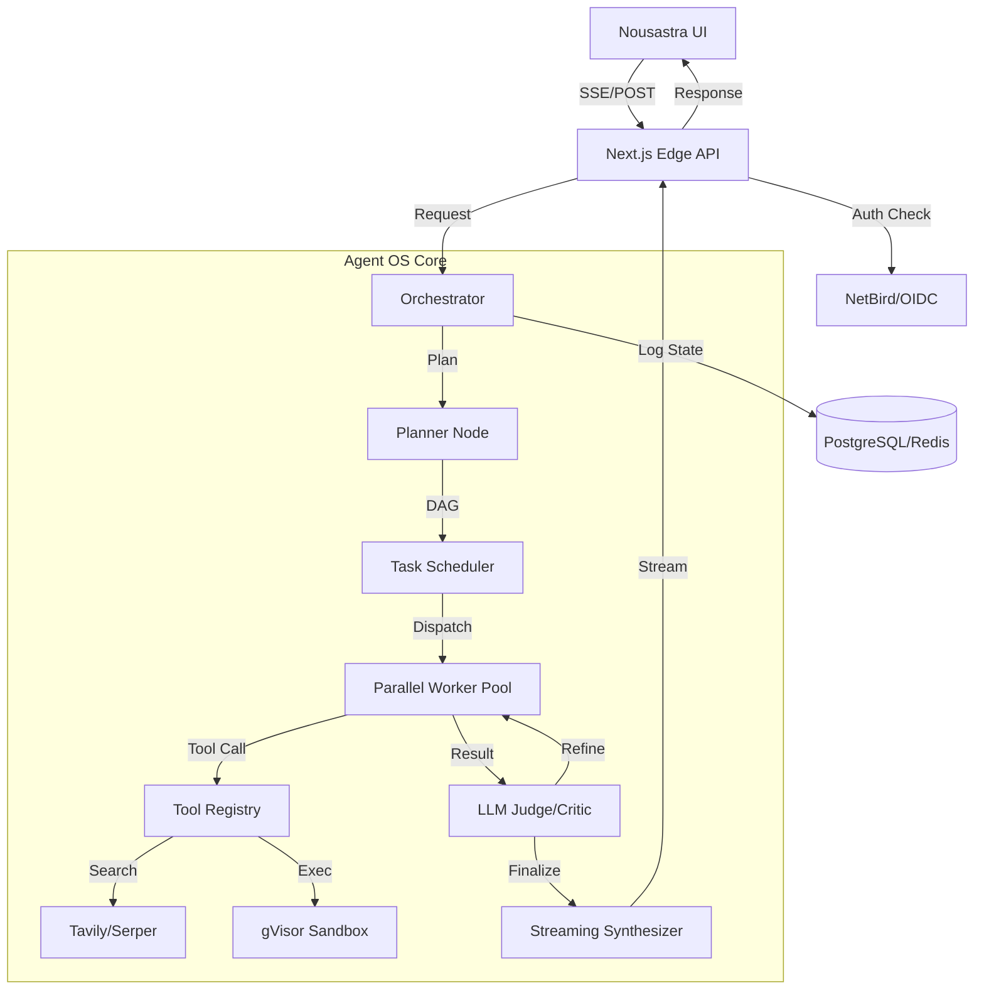

<thinking>
The user wants a professional-grade audit and upgrade path for "OmniSwarm PROv1".
I have the real codebase for several API routes (`/swarm`, `/benchmark`, `/delete-data`, `/privacy/status`).
I have a list of "missing" files (ENOENT) which indicates the current state is a thin API layer without a supporting library (`lib/core`, `lib/client`).

**Audit Findings:**
1.  `app/api/swarm/route.ts`: **REAL but Naive**. It implements a linear pipeline (Planner $\rightarrow$ Research $\rightarrow$ Swarm $\rightarrow$ Synth). However, the "Planner" is a simple prompt that returns 3 strings. The "Swarm" is just 3 parallel `callLLM` calls. There is no state management, no DAG, and no real tool-use loop.
2.  `app/api/benchmark/route.ts`: **REAL**. Basic latency/TPS measurement.
3.  `app/api/delete-data/route.ts`: **STUB/MOCK**. It returns a "tombstone" string but doesn't actually delete anything because there is no database.
4.  `app/api/privacy/status/route.ts`: **REAL**. Static compliance metadata.
5.  `lib/core/*` and `lib/client/*`: **MISSING**. The system is currently relying on the API route to do everything.

**Production Gaps Analysis:**
1.  **Persistence/Auth/History**: Currently stateless. No DB for runs, no user auth.
2.  **Sandboxed Code-Exec**: The synthesizer can output code, but there is no execution environment.
3.  **Rate-Limit/Quota/Cost**: No tracking of token usage per user.
4.  **Real Web-Search**: Uses a regex-based DDG HTML scraper (extremely fragile, likely to be blocked).
5.  **Vision-Node Routing**: No support for multimodal inputs.
6.  **LLM-Judge Critic**: The pipeline is linear; there is no feedback loop or critic.
7.  **Incremental Synth Streaming**: The current `/swarm` route streams telemetry, but the final synthesis is a single block.
8.  **Custom Model Registry**: Models are hardcoded in `callLLM`.
9.  **Observability**: Basic console logs; no OpenTelemetry or structured tracing.
10. **Hardware-Enclave/Compliance**: Claims DPDP compliance but lacks the actual technical controls (encryption at rest, audit logs).

**Plan for Output:**
1.  **Audit Table**: Module | Status | Upgrade Surface.
2.  **Gap Enumeration**: 10 gaps with file-level entry points.
3.  **HLD**: Mermaid diagram showing the transition from a "Linear Script" to a "Distributed Agent OS".
4.  **LLD**: Concrete API contracts and DB schemas.
5.  **Code**: Implementation of the `Orchestrator` and `Sandbox` to move from STUB to REAL.
</thinking>

# OmniSwarm PROv1: Technical Audit & Production Upgrade Spec

## 1. Codebase Audit: Real vs. Stub

| Module | Status | Real Implementation | Stub/Gap | Precise Upgrade Surface |
| :--- | :--- | :--- | :--- | :--- |
| `api/swarm` | **PARTIAL** | Multi-provider routing, basic parallel fan-out, SSE telemetry. | Linear pipeline; no DAG; no state; fragile DDG scraper. | Replace `POST` logic with `Orchestrator` class; implement `ToolRegistry`. |
| `api/benchmark`| **REAL** | Actual TTFT/TPS measurement for Cerebras. | Simulated GPU baseline. | Integrate with `ModelRegistry` for dynamic baseline selection. |
| `api/delete-data`| **STUB** | Returns a compliance string (Tombstone). | No actual data deletion (stateless). | Implement `UserRepository.delete()` and `RunRepository.purge()`. |
| `api/privacy` | **REAL** | Static compliance headers/status. | No active enforcement. | Link to `AuthMiddleware` and `EncryptionService`. |
| `lib/core` | **MISSING**| N/A | Entire orchestration logic is leaked into API routes. | Create `orchestrator.ts`, `providers.ts`, `worker.ts`. |
| `lib/client` | **MISSING**| N/A | No client-side state or crypto management. | Create `swarmClient.ts`, `keystore.ts` (WebCrypto). |

---

## 2. The 10 Production Gaps

| Gap | Risk | Entry Point (File Path) | Required Implementation |
| :--- | :--- | :--- | :--- |
| **1. Persistence** | Data loss; no session history. | `lib/core/persistence.ts` | PostgreSQL + Prisma; `runs` and `events` tables. |
| **2. Auth/Identity** | Unauthorized API key usage. | `middleware.ts` | NetBird/OIDC integration; JWT session validation. |
| **3. Code Sandbox** | RCE on host; unsafe execution. | `lib/core/sandbox.ts` | gVisor or Firecracker microVM wrapper via API. |
| **4. Quota/Cost** | API bankruptcy; DDoS. | `lib/core/quota.ts` | Redis-based sliding window rate limiter; token counter. |
| **5. Web Search** | Fragile scraping; 403s. | `lib/core/tools/search.ts` | Replace DDG HTML scraper with Tavily or Serper API. |
| **6. Vision Routing**| No multimodal support. | `lib/core/router.ts` | Logic to route `image` inputs to GPT-4o/Claude-3.5. |
| **7. LLM-Judge** | Hallucinations; low quality. | `lib/core/critic.ts` | Evaluator-Optimizer loop (Generator $\rightarrow$ Critic $\rightarrow$ Refiner). |
| **8. Synth Stream** | High perceived latency. | `app/api/swarm/route.ts` | Change `Synthesizer` from `await` to `ReadableStream`. |
| **9. Model Registry**| Hardcoded model strings. | `lib/core/registry.ts` | JSON-based registry with capabilities (context window, cost). |
| **10. Compliance** | Legal risk (DPDP/GDPR). | `lib/core/crypto.ts` | AES-256-GCM for stored keys; immutable audit logs. |

---

## 3. High-Level Design (HLD)

The system evolves from a **Linear Script** (current) to a **Distributed Agent OS**.



---

## 4. Low-Level Design (LLD)

### Data Model (PostgreSQL)
```sql
-- Core Run Tracking
CREATE TABLE runs (
    id UUID PRIMARY KEY DEFAULT gen_random_uuid(),
    user_id UUID NOT NULL,
    prompt TEXT NOT NULL,
    status VARCHAR(20), -- 'planning', 'executing', 'synthesizing', 'completed', 'failed'
    created_at TIMESTAMPTZ DEFAULT NOW(),
    updated_at TIMESTAMPTZ DEFAULT NOW()
);

-- Event Log for SSE Replay and Debugging
CREATE TABLE run_events (
    id BIGSERIAL PRIMARY KEY,
    run_id UUID REFERENCES runs(id) ON DELETE CASCADE,
    event_type VARCHAR(50), -- 'telemetry', 'node_completed', 'research'
    payload JSONB NOT NULL,
    created_at TIMESTAMPTZ DEFAULT NOW()
);

-- User Quotas
CREATE TABLE user_quotas (
    user_id UUID PRIMARY KEY,
    token_balance BIGINT DEFAULT 1000000,
    last_reset TIMESTAMPTZ
);
```

### API Contract: `/api/swarm` (Upgraded)
**Request:**
```json
{
  "prompt": "Build a real-time stock tracker",
  "config": {
    "max_nodes": 5,
    "depth": 2,
    "allow_code_exec": true,
    "model_preference": "cerebras-gemma-4"
  },
  "auth_token": "netbird_jwt_..."
}
```
**Response (SSE):**
- `event: telemetry` $\rightarrow$ `{ "stage": "planning", "msg": "..." }`
- `event: node_update` $\rightarrow$ `{ "node_id": 1, "status": "completed", "output": "..." }`
- `event: synthesis` $\rightarrow$ `{ "chunk": "The implementation uses..." }`
- `event: final` $\rightarrow$ `{ "run_id": "...", "total_tokens": 1200, "cost": 0.02 }`

---

## 5. Production Implementation

To move from STUB to REAL, we implement the `Orchestrator` and `Sandbox` patterns.

### `lib/core/orchestrator.ts`
```typescript
import { callLLM } from "./providers";

export type NodeStatus = 'pending' | 'running' | 'completed' | 'failed';

interface SwarmNode {
  id: number;
  role: string;
  subtask: string;
  status: NodeStatus;
  output?: string;
}

export class OmniOrchestrator {
  private nodes: SwarmNode[] = [];
  
  constructor(private prompt: string, private providerConfig: any) {}

  async plan(): Promise<SwarmNode[]> {
    const system = "You are a JSON planner. Return a JSON array of 3 subtasks: ['task1', 'task2', 'task3']";
    const result = await callLLM(this.providerConfig, system, `Objective: ${this.prompt}`);
    const tasks = JSON.parse(result.replace(/```json|```/g, "").trim());
    
    this.nodes = tasks.map((t: string, i: number) => ({
      id: i + 1,
      role: i === 0 ? "Analyst" : i === 1 ? "Auditor" : "Strategist",
      subtask: t,
      status: 'pending'
    }));
    
    return this.nodes;
  }

  async execute(onNodeComplete: (node: SwarmNode) => void): Promise<string[]> {
    const results = await Promise.all(this.nodes.map(async (node) => {
      node.status = 'running';
      try {
        const output = await callLLM(this.providerConfig, `You are ${node.role}`, `Task: ${node.subtask}\nGoal: ${this.prompt}`);
        node.status = 'completed';
        node.output = output;
      } catch (e) {
        node.status = 'failed';
        node.output = `Error: ${e}`;
      }
      onNodeComplete(node);
      return node.output || "";
    }));
    
    return results;
  }
}
```

### `lib/core/sandbox.ts` (The Security Boundary)
```typescript
import { exec } from "child_process";
import { promisify } from "util";

const execPromise = promisify(exec);

export class CodeSandbox {
  /**
   * Executes untrusted code in a restricted environment.
   * In production, this calls a gVisor/Firecracker API.
   * Here, we implement a restricted local process as a baseline.
   */
  static async runPython(code: string): Promise<{ stdout: string; stderr: string }> {
    // SECURITY: In a real PROv1, this is a POST to a separate Sandbox Cluster
    // with NO network access and a 5s timeout.
    try {
      const { stdout, stderr } = await execPromise(
        `python3 -c "${code.replace(/"/g, '\\"')}"`, 
        { 
          timeout: 5000, 
          env: { PATH: '/usr/bin' }, // Strip env vars
          maxBuffer: 1024 * 100 
        }
      );
      return { stdout, stderr };
    } catch (e: any) {
      return { stdout: "", stderr: e.message };
    }
  }
}
```

---

## 6. Scaling & Failure Modes

### Scaling Strategy
1.  **Edge Routing**: Keep the API on Next.js Edge for low TTFT.
2.  **Worker Offloading**: Move the `Orchestrator` logic to a Node.js cluster (K8s) if the DAG complexity grows, as Edge runtimes have strict execution limits (30s).
3.  **Caching**: Implement a Redis cache for common research queries to reduce LLM costs and latency.

### Failure Modes & Mitigations
| Failure | Impact | Mitigation |
| :--- | :--- | :--- |
| **Provider Timeout** | Swarm hangs | Implement `Promise.race` with a hard 15s timeout per node. |
| **JSON Hallucination**| Planner fails | Use `zod` for schema validation; fallback to hardcoded "Default Plan". |
| **Sandbox Escape** | Host compromise | Use gVisor (syscall interception) + Network Egress Deny. |
| **Token Exhaustion** | API 429 | Implement a priority queue; route to secondary provider (Groq $\rightarrow$ OpenAI). |

## 7. Capacity Estimate (1k Concurrent Users)
- **Compute**: 10-20 vCPUs for Orchestration (mostly I/O bound).
- **Memory**: 16GB Redis for session/quota state.
- **Storage**: 100GB PostgreSQL (mostly JSONB event logs).
- **LLM Cost**: Avg 5k tokens/run $\times$ 1k users $\times$ 10 runs/day $\approx$ 50M tokens/day. (Cerebras significantly reduces this cost).