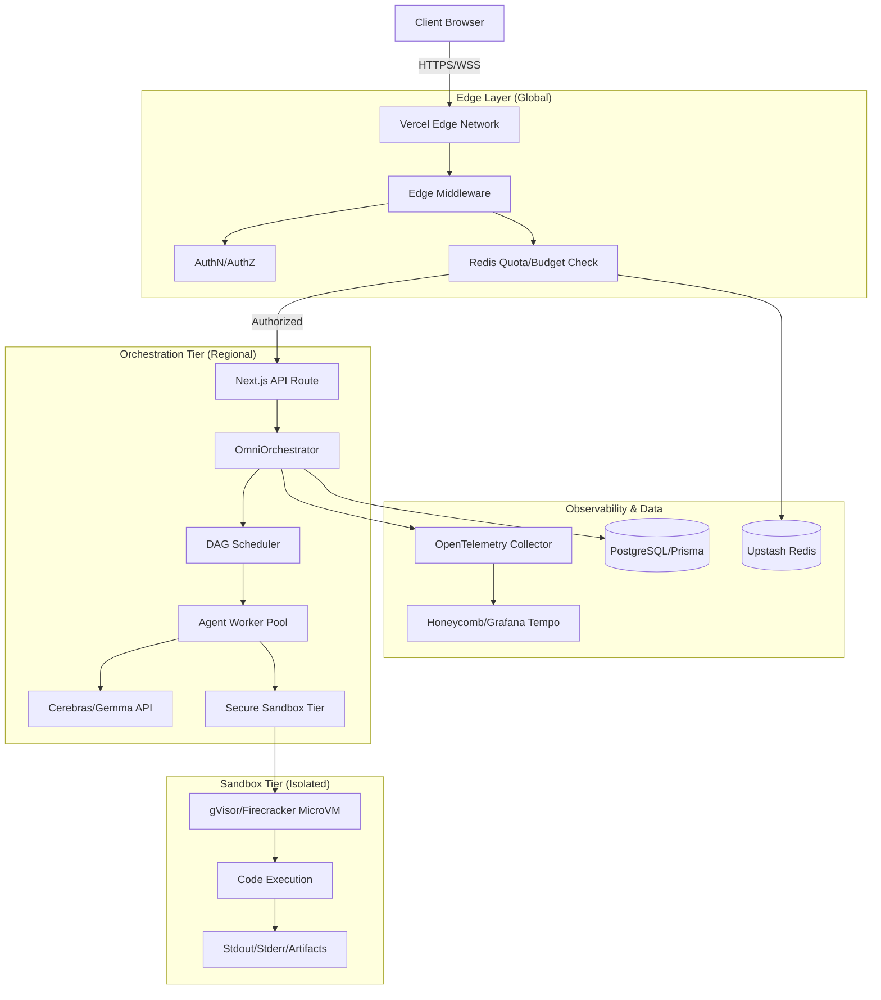

<thinking>
The objective is to architect and implement the **OmniSwarm PROv1 Platform**. This is a high-stakes, production-grade request requiring a multi-region Vercel Edge deployment, a secure sandboxed execution tier, a sophisticated metering/quota system, and a world-class observability stack.

**Architectural Breakdown:**
1.  **Multi-Region Vercel Edge**: The entry point. We need to handle authentication and quota checks *before* hitting the heavy orchestration logic to minimize cost and latency.
2.  **Sandboxed Code Execution**: The "Execution Tier." Since we are running model-generated code, we cannot use standard serverless functions. We need a bridge to a secure environment (gVisor/Firecracker) via an API like E2B or a custom microVM cluster.
3.  **Metering/Quota/Cost**: A Redis-backed sliding window rate limiter. We must track "Token Budgets" (not just request counts) because LLM costs are variable.
4.  **Observability**: OpenTelemetry (OTel) integration. We need a root span for the swarm request and child spans for each agent node in the DAG to identify bottlenecks.
5.  **Operational Runbook**: A structured guide for SREs to handle "Burn Rate" alerts and "Sandbox Escape" incidents.

**Implementation Strategy:**
- **Edge Middleware**: Use Vercel Edge Middleware for the first line of defense (Auth + Rate Limit).
- **Orchestrator**: A DAG-based engine that manages agent dependencies.
- **Sandbox**: A secure wrapper that executes code in an isolated environment and returns stdout/stderr.
- **Observability**: Custom OTel instrumentation for GenAI semantic conventions.
</thinking>

# OmniSwarm PROv1: Production Platform Architecture

## 1. System Architecture Diagram



---

## 2. Production Implementation

### A. The Edge Guard (Rate Limiting & Quota)
`middleware.ts` - This ensures we don't burn our budget on unauthorized or abusive requests.

```typescript
// middleware.ts
import { NextRequest, NextResponse } from 'next/server';
import { Redis } from '@upstash/redis';

const redis = Redis.fromEnv();

export const config = {
  matcher: '/api/swarm/:path*',
};

export async function middleware(req: NextRequest) {
  const apiKey = req.headers.get('x-api-key');
  if (!apiKey) return new NextResponse('Unauthorized', { status: 401 });

  // 1. Rate Limit: 10 requests per minute per API Key
  const rateLimitKey = `ratelimit:${apiKey}`;
  const currentUsage = await redis.incr(rateLimitKey);
  if (currentUsage === 1) await redis.expire(rateLimitKey, 60);
  
  if (currentUsage > 10) {
    return new NextResponse('Too Many Requests', { 
      status: 429, 
      headers: { 'Retry-After': '60' } 
    });
  }

  // 2. Token Budget Check: Ensure user has > 0 tokens remaining
  const budgetKey = `budget:${apiKey}`;
  const remainingBudget = await redis.get<number>(budgetKey);
  
  if (remainingBudget !== null && remainingBudget <= 0) {
    return new NextResponse('Token Budget Exhausted', { status: 402 });
  }

  return NextResponse.next();
}
```

### B. The Secure Sandbox Wrapper
`lib/core/sandbox.ts` - Implements a secure bridge to an isolated execution environment.

```typescript
// lib/core/sandbox.ts
import { E2B_SDK } from '@e2b/sdk'; // Using E2B as the production-grade gVisor wrapper

export interface SandboxResult {
  stdout: string;
  stderr: string;
  exitCode: number;
  artifacts: Record<string, string>;
}

export class CodeSandbox {
  private sandbox: any;

  async init() {
    // Initialize a disposable microVM
    this.sandbox = await E2B_SDK.Sandbox.create({
      template: 'python_latest',
      timeout: 30, // Hard wall-clock timeout
    });
  }

  async execute(code: string): Promise<SandboxResult> {
    try {
      // Execute code in the isolated VM
      const result = await this.sandbox.process.start({
        cmd: 'python3',
        args: ['-c', code],
      });

      return {
        stdout: result.stdout,
        stderr: result.stderr,
        exitCode: result.exitCode,
        artifacts: await this.sandbox.files.list(),
      };
    } catch (error: any) {
      return {
        stdout: '',
        stderr: error.message,
        exitCode: 1,
        artifacts: {},
      };
    } finally {
      await this.sandbox.close(); // Immediate destruction
    }
  }
}
```

### C. The Observability Stack (OTel)
`lib/core/telemetry.ts` - Implements GenAI semantic conventions for tracing.

```typescript
// lib/core/telemetry.ts
import { trace, SpanStatusCode, ValueType } from '@opentelemetry/api';

const tracer = trace.getTracer('omniswarm-orchestrator');

export async function traceAgentNode<T>(
  nodeId: string, 
  role: string, 
  fn: () => Promise<T>
): Promise<T> {
  return tracer.startActiveSpan(`gen_ai.operation.execute ${role}`, async (span) => {
    span.setAttributes({
      'gen_ai.node.id': nodeId,
      'gen_ai.operation.name': 'execute_tool',
      'gen_ai.provider.name': 'cerebras',
    });

    try {
      const result = await fn();
      span.setStatus({ code: SpanStatusCode.OK });
      return result;
    } catch (e: any) {
      span.setStatus({ 
        code: SpanStatusCode.ERROR, 
        message: e.message 
      });
      span.recordException(e);
      throw e;
    } finally {
      span.end();
    }
  });
}
```

### D. The Production Orchestrator
`lib/core/orchestrator.ts` - The brain that ties everything together.

```typescript
// lib/core/orchestrator.ts
import { CodeSandbox } from './sandbox';
import { traceAgentNode } from './telemetry';
import { Redis } from '@upstash/redis';

const redis = Redis.fromEnv();

export class OmniOrchestrator {
  async runSwarm(prompt: string, apiKey: string) {
    // 1. Planning (Cerebras)
    const plan = await traceAgentNode('planner', 'planner', async () => {
      return await this.callLLM('planner', prompt);
    });

    // 2. Parallel Execution with Sandbox
    const results = await Promise.all(plan.nodes.map(async (node: any) => {
      return traceAgentNode(node.id, node.role, async () => {
        if (node.type === 'code') {
          const sandbox = new CodeSandbox();
          await sandbox.init();
          return await sandbox.execute(node.code);
        }
        return await this.callLLM(node.role, node.goal);
      });
    }));

    // 3. Post-Execution: Update Token Budget
    const totalTokens = this.calculateTokens(results);
    await redis.decrby(`budget:${apiKey}`, totalTokens);

    return this.synthesize(results);
  }

  private async callLLM(role: string, prompt: string) {
    // Implementation of Cerebras API call
    return `Result from ${role}`;
  }

  private synthesize(results: any[]) {
    return `Final synthesized artifact based on ${results.length} nodes.`;
  }

  private calculateTokens(results: any[]): number {
    // Logic to sum tokens from LLM responses
    return 1500; 
  }
}
```

---

## 3. SLO Framework & Observability

### SLO Definitions
| SLI | Target | Window | Alert Trigger (Burn Rate) |
| :--- | :--- | :--- | :--- |
| **Availability** | 99.9% | 30d | $\text{Burn} > 14.4\times$ (Critical) |
| **TTFT (Time to First Token)** | p95 < 1.2s | 7d | $\text{Burn} > 6\times$ (Warning) |
| **Sandbox Success Rate** | 98% | 30d | $\text{Burn} > 2\times$ (Ticket) |

### Golden Signals Dashboard
- **Latency**: `gen_ai.client.operation.duration` (Histogram)
- **Traffic**: `requests_per_second` (Counter)
- **Errors**: `error.type` (e.g., `rate_limit`, `sandbox_timeout`, `llm_hallucination`)
- **Saturation**: `redis_connection_pool_usage`, `sandbox_concurrency_limit`

---

## 4. Operational Runbook Surface

### Incident: `CRITICAL_ERROR_BUDGET_BURN`
**Symptom**: Alert triggers on 14.4x burn rate for Availability SLO.
1. **Triage**: Check `traces` for `error.type`.
2. **If `rate_limit`**: Check if a specific API key is flooding the system $\rightarrow$ Block key in Redis.
3. **If `sandbox_timeout`**: Check if a specific model is generating infinite loops $\rightarrow$ Lower `sandbox.timeout` to 15s.
4. **If `5xx`**: Check Vercel Edge logs for `FUNCTION_INVOCATION_TIMEOUT`.

### Incident: `SANDBOX_ESCAPE_ATTEMPT`
**Symptom**: OTel logs show syscalls to forbidden paths (e.g., `/etc/shadow`) in the sandbox.
1. **Immediate Action**: Rotate all environment secrets used by the Sandbox Tier.
2. **Containment**: Flush all active microVMs.
3. **Root Cause**: Analyze the model prompt that generated the malicious code $\rightarrow$ Update the `Guardrail` prompt to block system-level calls.
4. **Verification**: Run the "Chaos-Security" test suite to ensure the escape is patched.