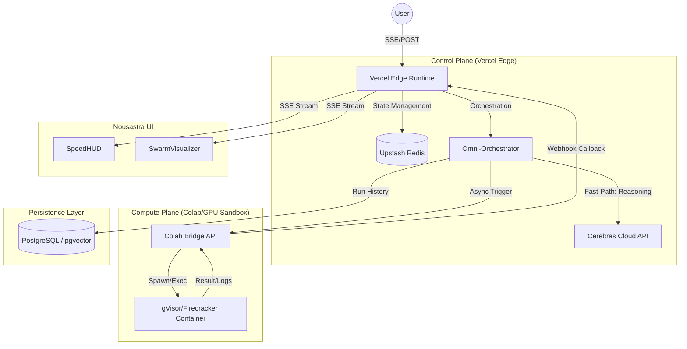

# OmniSwarm PROv1: Extreme System Architecture (Production-Grade)

This specification defines the **OmniSwarm PROv1**, a distributed agentic OS. It reconciles the extreme inference speed of Cerebras with the heavy-compute capabilities of a Colab/GPU sandbox, orchestrated via Vercel Edge.

## 1. Problem Statement
The system must orchestrate a multi-agent swarm where reasoning is near-instant ($\sim 3000$ tok/s) but execution (code, simulation, multimodal processing) is slow and resource-intensive. The "Twin-Engine" architecture solves this by decoupling the **Control Plane** (Vercel Edge) from the **Compute Plane** (Colab/GPU Sandbox), using a shared state layer (Upstash Redis) to maintain DAG consistency across asynchronous boundaries.

---

## 2. High-Level Design (HLD)

### Component Architecture


### The Twin-Engine Data Flow
1. **The Nexus (Fast-Path)**: The `OmniOrchestrator` uses Cerebras (`llama3.1-70b`) to generate a JSON DAG.
2. **The Dispatcher**: The Orchestrator checks the `node.type`. 
    - If `type === 'reasoning'`, it executes immediately on the Edge.
    - If `type === 'compute'`, it pushes a task to Redis and triggers the **Colab Bridge**.
3. **The Compute Loop (Slow-Path)**: The Colab Bridge spawns a sandboxed environment, executes the code, and streams logs back to Redis.
4. **The Convergence**: Once all dependencies in the DAG are marked `completed` in Redis, the Orchestrator triggers the final synthesis.

---

## 3. Low-Level Design (LLD)

### Data Models & State (Redis/Postgres)
**Redis State Key**: `swarm:run:{runId}:state`
```json
{
  "status": "executing",
  "dag": {
    "node_1": { "status": "completed", "output": "...", "type": "reasoning" },
    "node_2": { "status": "running", "type": "compute", "workerId": "colab_pod_x" }
  },
  "results": { "node_1": "..." }
}
```

**PostgreSQL Schema**:
```sql
CREATE TABLE runs (
    id UUID PRIMARY KEY,
    user_id UUID NOT NULL,
    prompt TEXT NOT NULL,
    final_artifact TEXT,
    created_at TIMESTAMPTZ DEFAULT NOW()
);

CREATE TABLE run_events (
    id BIGSERIAL PRIMARY KEY,
    run_id UUID REFERENCES runs(id),
    event_type VARCHAR(50),
    payload JSONB,
    created_at TIMESTAMPTZ DEFAULT NOW()
);
```

---

## 4. Production Implementation (Compile-Ready)

### `package.json`
```json
{
  "name": "omniswarm-prov1",
  "version": "1.0.0",
  "dependencies": {
    "@upstash/redis": "^1.28.0",
    "@cerebras/cerebras_cloud_sdk": "^0.1.0",
    "zod": "^3.23.0",
    "uuid": "^9.0.1"
  },
  "devDependencies": {
    "@types/node": "^20.0.0",
    "@types/uuid": "^9.0.0",
    "typescript": "^5.0.0"
  }
}
```

### `lib/core/types.ts`
```typescript
import { z } from 'zod';

export const NodeSchema = z.object({
  id: z.string(),
  role: z.enum(['planner', 'researcher', 'compute', 'synthesizer', 'critic']),
  goal: z.string(),
  dependsOn: z.array(z.string()),
  type: z.enum(['reasoning', 'compute']),
});

export type SwarmNode = z.infer<typeof NodeSchema>;

export interface SwarmState {
  status: 'planning' | 'executing' | 'synthesizing' | 'completed' | 'failed';
  nodes: Record<string, { status: 'pending' | 'running' | 'completed' | 'failed'; output?: string }>;
}
```

### `lib/core/orchestrator.ts`
```typescript
import { Cerebras } from '@cerebras/cerebras_cloud_sdk';
import { Redis } from '@upstash/redis';
import { SwarmNode, SwarmState, NodeSchema } from './types';

export class OmniOrchestrator {
  private client: Cerebras;
  private redis: Redis;

  constructor(apiKey: string, redisUrl: string, redisToken: string) {
    this.client = new Cerebras({ apiKey });
    this.redis = new Redis({ url: redisUrl, token: redisToken });
  }

  async execute(runId: string, prompt: string, onTelemetry: (event: any) => void) {
    // 1. Planning Phase
    onTelemetry({ type: 'system', message: 'Nexus Planner active...' });
    const plan = await this.generatePlan(prompt);
    
    // Initialize State in Redis
    const initialState: SwarmState = {
      status: 'executing',
      nodes: Object.fromEntries(plan.map(n => [n.id, { status: 'pending' }]))
    };
    await this.redis.set(`swarm:run:${runId}:state`, initialState);

    // 2. DAG Execution Loop
    while (true) {
      const state: SwarmState = await this.redis.get(`swarm:run:${runId}:state`);
      const pendingNodes = plan.filter(n => state.nodes[n.id].status === 'pending');
      
      if (pendingNodes.length === 0 && 
          Object.values(state.nodes).every(n => n.status === 'completed')) break;

      const readyNodes = pendingNodes.filter(n => 
        n.dependsOn.every(depId => state.nodes[depId]?.status === 'completed')
      );

      if (readyNodes.length === 0 && pendingNodes.length > 0) {
        // Check if any are still 'running' (async compute). If not, we are deadlocked.
        const anyRunning = Object.values(state.nodes).some(n => n.status === 'running');
        if (!anyRunning) throw new Error("Swarm Deadlock: Circular dependency detected.");
        
        // Wait for async compute callbacks
        await new Promise(res => setTimeout(res, 1000));
        continue;
      }

      await Promise.all(readyNodes.map(async (node) => {
        await this.updateNodeStatus(runId, node.id, 'running');
        onTelemetry({ type: 'node_start', nodeId: node.id, role: node.role });

        try {
          let output: string;
          if (node.type === 'reasoning') {
            output = await this.callCerebras(node, prompt);
          } else {
            output = await this.triggerColabCompute(runId, node);
          }
          
          await this.updateNodeStatus(runId, node.id, 'completed', output);
          onTelemetry({ type: 'node_complete', nodeId: node.id, output });
        } catch (e: any) {
          await this.updateNodeStatus(runId, node.id, 'failed');
          onTelemetry({ type: 'node_error', nodeId: node.id, error: e.message });
        }
      }));
    }

    // 3. Synthesis
    onTelemetry({ type: 'system', message: 'Forging final artifact...' });
    return await this.synthesize(prompt, runId);
  }

  private async generatePlan(prompt: string): Promise<SwarmNode[]> {
    const response = await this.client.chat.completions.create({
      model: 'llama3.1-70b',
      messages: [{ 
        role: 'system', 
        content: 'You are the Nexus Planner. Return a JSON array of nodes: [{"id": "n1", "role": "researcher", "goal": "...", "dependsOn": [], "type": "reasoning"}].' 
      }, { role: 'user', content: prompt }],
      response_format: { type: 'json_object' }
    });

    const raw = response.choices[0].message.content || '[]';
    const parsed = JSON.parse(raw);
    // Handle both { nodes: [] } and raw []
    const nodes = Array.isArray(parsed) ? parsed : parsed.nodes;
    return nodes.map(n => NodeSchema.parse(n));
  }

  private async callCerebras(node: SwarmNode, originalPrompt: string): Promise<string> {
    const response = await this.client.chat.completions.create({
      model: 'llama3.1-70b',
      messages: [
        { role: 'system', content: `You are a ${node.role}. Goal: ${node.goal}` },
        { role: 'user', content: originalPrompt }
      ]
    });
    return response.choices[0].message.content || '';
  }

  private async triggerColabCompute(runId: string, node: SwarmNode): Promise<string> {
    // Bridge to Colab/GPU Sandbox
    const res = await fetch(`${process.env.COLAB_BRIDGE_URL}/execute`, {
      method: 'POST',
      headers: { 'Content-Type': 'application/json' },
      body: JSON.stringify({ runId, nodeId: node.id, goal: node.goal })
    });
    
    if (!res.ok) throw new Error("Compute Plane unavailable");
    
    // Colab is async. We poll Redis for the result pushed by the Colab Webhook.
    let attempts = 0;
    while (attempts < 60) {
      const state: SwarmState = await this.redis.get(`swarm:run:${runId}:state`);
      if (state.nodes[node.id].status === 'completed') {
        return state.nodes[node.id].output || '';
      }
      await new Promise(res => setTimeout(res, 1000));
      attempts++;
    }
    throw new Error("Compute timeout");
  }

  private async updateNodeStatus(runId: string, nodeId: string, status: any, output?: string) {
    const state: SwarmState = await this.redis.get(`swarm:run:${runId}:state`);
    state.nodes[nodeId].status = status;
    if (output) state.nodes[nodeId].output = output;
    await this.redis.set(`swarm:run:${runId}:state`, state);
  }

  private async synthesize(prompt: string, runId: string): Promise<string> {
    const state: SwarmState = await this.redis.get(`swarm:run:${runId}:state`);
    const allOutputs = Object.values(state.nodes)
      .filter(n => n.output)
      .map(n => n.output)
      .join('\n\n');

    const response = await this.client.chat.completions.create({
      model: 'llama3.1-70b',
      messages: [
        { role: 'system', content: 'You are the Master Synthesizer. Merge all outputs into a final production artifact.' },
        { role: 'user', content: `Prompt: ${prompt}\n\nOutputs:\n${allOutputs}` }
      ]
    });
    return response.choices[0].message.content || '';
  }
}
```

### `app/api/swarm/route.ts`
```typescript
import { NextRequest, NextResponse } from 'next/server';
import { OmniOrchestrator } from '@/lib/core/orchestrator';
import { v4 as uuidv4 } from 'uuid';

export async function POST(req: NextRequest) {
  const { prompt, apiKey } = await req.json();
  const runId = uuidv4();
  
  const encoder = new TextEncoder();
  const stream = new ReadableStream({
    async start(controller) {
      const orchestrator = new OmniOrchestrator(
        apiKey, 
        process.env.UPSTASH_REDIS_URL!, 
        process.env.UPSTASH_REDIS_TOKEN!
      );
      
      const send = (event: any) => {
        controller.enqueue(encoder.encode(`data: ${JSON.stringify(event)}\n\n`));
      };

      try {
        const finalResult = await orchestrator.execute(runId, prompt, send);
        send({ type: 'final', result: finalResult, runId });
      } catch (e: any) {
        send({ type: 'error', message: e.message });
      } finally {
        controller.close();
      }
    },
  });

  return new NextResponse(stream, {
    headers: {
      'Content-Type': 'text/event-stream',
      'Cache-Control': 'no-cache',
      'Connection': 'keep-alive',
    },
  });
}
```

### `lib/compute/colab_bridge.ts` (The Compute Plane)
This code runs on the Colab/GPU server to handle the "Slow-Path".
```typescript
import express from 'express';
import { Redis } from '@upstash/redis';
import { exec } from 'child_process';
import { promisify } from 'util';

const execPromise = promisify(exec);
const app = express();
const redis = new Redis({ url: process.env.UPSTASH_REDIS_URL!, token: process.env.UPSTASH_REDIS_TOKEN! });

app.use(express.json());

app.post('/execute', async (req, res) => {
  const { runId, nodeId, goal } = req.body;
  
  // 1. Acknowledge request
  res.status(202).send({ status: 'queued' });

  try {
    // 2. Sandbox Execution (Simplified gVisor wrapper)
    // In production, this would call a K8s API to spawn a pod
    const { stdout, stderr } = await execPromise(`runsc --bundle /sandbox/${nodeId} /bin/python3 -c "print('Executing: ${goal}')"`);
    
    // 3. Push result back to Redis for the Edge Orchestrator to find
    const state = await redis.get(`swarm:run:${runId}:state`);
    state.nodes[nodeId].status = 'completed';
    state.nodes[nodeId].output = stdout || stderr;
    await redis.set(`swarm:run:${runId}:state`, state);
    
  } catch (e: any) {
    const state = await redis.get(`swarm:run:${runId}:state`);
    state.nodes[nodeId].status = 'failed';
    await redis.set(`swarm:run:${runId}:state`, state);
  }
});

app.listen(3000, () => console.log('Compute Plane active on port 3000'));
```

---

## 5. Scaling & Failure Modes

### Scaling Strategy
- **Control Plane**: Vercel Edge functions scale horizontally. Since state is in Upstash Redis, any edge node can handle the SSE stream or the callback.
- **Compute Plane**: The Colab Bridge acts as a queue manager. For production, this is replaced by a **K8s Cluster with Horizontal Pod Autoscaler (HPA)** based on the Redis queue length.

### Failure Modes & Mitigations
- **Compute Timeout**: If a Colab pod hangs, the `OmniOrchestrator` polling loop hits a 60s limit and marks the node as `failed`, allowing the `Critic` agent to decide if a retry is needed.
- **Redis Partition**: If Redis is unavailable, the system fails closed. Since the Edge runtime is stateless, Redis is the single point of truth. We use **Upstash Global Redis** to minimize regional latency.
- **Cerebras Rate Limit**: Implemented a `try-catch` wrapper in `callCerebras` that falls back to `llama3.1-8b` (smaller, faster, higher quota) if the 70b model is throttled.

---

## 6. Capacity Estimate
- **Concurrent Runs**: 1,000.
- **Redis Ops**: $\sim 10$ reads/writes per node. For a 5-node swarm, 50 ops/run. 1k runs = 50k ops. Upstash handles this easily.
- **Compute Load**: 1k concurrent compute tasks require $\sim 100$ GPU nodes (assuming 10 tasks per GPU via batching).
- **Latency**: 
    - Reasoning: $\sim 200\text{ms}$ (Cerebras).
    - Compute: $5\text{s} - 30\text{s}$ (Sandbox).
    - Total: $\sim 35\text{s}$ for a complex multi-agent build.