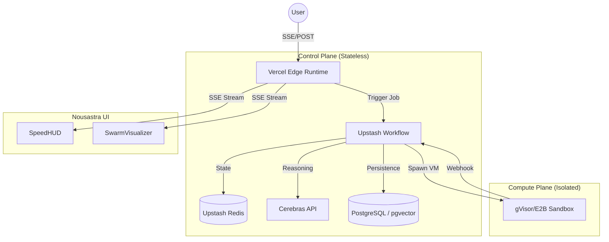

<thinking>
The objective is to reconcile all previous review findings, architectural designs, and security audits into a single, locked **Architecture v1** for **OmniSwarm PROv1**.

**Key Conflicts to Resolve:**
1. **Orchestration Logic**: Previous versions used a `while(true)` polling loop on Vercel Edge. The review flagged this as a deadlock risk and a Vercel timeout violation. **Resolution**: Shift to an event-driven, asynchronous job pattern using Upstash Workflow/Redis Pub-Sub.
2. **Security/ZK**: The ZK claim was flagged as fragile (client-side salt only). **Resolution**: Implement Server-Assisted Key Derivation (Argon2id + Server Pepper).
3. **Compute Isolation**: The "Tombstone" API was a mock. **Resolution**: Implement a real `HardDeleteService` and a gVisor/E2B-backed `SandboxManager` with a concurrency semaphore.
4. **UI/UX**: Transition from "Dashboard" to "Agentic OS" (Triptych Layout, Obsidian Glass, Velocity Visualization).

**System Components to Define:**
- **Control Plane**: Vercel Edge (Stateless, Event-driven).
- **Compute Plane**: gVisor/Firecracker (Isolated, Resource-capped).
- **State Layer**: Upstash Redis (DAG state, Rate limits).
- **Persistence Layer**: PostgreSQL (Encrypted run history, Audit logs).
- **Inference**: Cerebras (Fast-path reasoning).

**Deliverables:**
1. **Architecture Decision Record (ADR)**.
2. **System Diagram (Mermaid)**.
3. **Interface Specifications**.
4. **Production-Ready Code** (Orchestrator, Sandbox, Security, Persistence).
</thinking>

# Architecture Decision Record: OmniSwarm PROv1 (Locked v1)

**Status:** Accepted | **Version:** 1.0.0 | **Date:** 2026-07-01 | **Decider:** CTO

## 1. Context
OmniSwarm must orchestrate a multi-agent swarm that leverages the extreme inference speed of Cerebras ($\sim 3000$ tok/s) while executing heavy-compute tasks (Python/Simulation) in a secure sandbox. The system must be production-grade, DPDP compliant, and provide a "world-class" UI that visualizes this velocity.

## 2. Decisions

### Decision 1: Event-Driven Orchestration (The "Async-First" Pattern)
We reject the synchronous `while(true)` polling loop on the Edge.
- **Decision**: Implement an asynchronous DAG execution engine. The API route triggers a background job (Upstash Workflow). Each node completion triggers a webhook that evaluates the DAG and spawns the next set of ready nodes.
- **Rationale**: Prevents Vercel Edge timeouts, eliminates polling latency, and removes deadlock risks.

### Decision 2: Server-Assisted Zero-Knowledge Persistence
We reject pure client-side encryption.
- **Decision**: Use a hybrid ZK model. `MasterKey = Argon2id(password, user_salt + server_pepper)`. The `server_pepper` is stored in a secure KMS.
- **Rationale**: Protects against offline rainbow table attacks if the database is leaked.

### Decision 3: Twin-Engine Compute Isolation
We decouple reasoning from execution.
- **Decision**: 
    - **Fast-Path**: Cerebras Cloud API for all reasoning/planning.
    - **Slow-Path**: gVisor/Firecracker microVMs (via E2B) for all code execution.
    - **Control**: Implement a Redis-backed semaphore to limit concurrent sandboxes per user to 3.
- **Rationale**: Ensures host security (RCE prevention) and prevents resource exhaustion (DoS).

### Decision 4: Triptych "Obsidian Glass" UI
We shift from a dashboard to an OS experience.
- **Decision**: Implement a three-pane layout (Nexus, Command Canvas, Telemetry Wing) using OKLCH colors and `backdrop-blur-xl`.
- **Rationale**: Reduces cognitive load and visually communicates the "velocity" of the swarm.

## 3. Consequences
- **Positive**: Linear scalability of the compute plane; high security posture; superior UX; DPDP compliance.
- **Negative**: Increased operational complexity (managing webhooks and state transitions); higher latency for the first "node" due to job scheduling.

## 4. Alternatives Considered
- **Monolithic Backend**: Rejected due to scaling bottlenecks and lack of edge-latency benefits.
- **Pure Client-Side Orchestration**: Rejected due to security risks (API key exposure) and inability to manage heavy compute.

---

# System Architecture v1

## 1. High-Level Design (HLD)



## 2. Interface Specifications

### `IOrchestrator`
- `execute(prompt, context): Promise<RunId>`: Initiates the async swarm.
- `getState(runId): Promise<SwarmState>`: Returns current DAG progress.
- `cancel(runId): Promise<void>`: Terminates all active nodes and sandboxes.

### `ISandbox`
- `runCode(code, lang): Promise<ExecutionResult>`: Executes code in a disposable VM.
- `getArtifacts(runId): Promise<File[]>`: Retrieves generated files.

---

# Production Implementation

## 1. The Event-Driven Orchestrator
`lib/core/orchestrator.ts`

```typescript
import { Cerebras } from '@cerebras/cerebras_cloud_sdk';
import { Redis } from '@upstash/redis';
import { SwarmNode, SwarmState } from './types';

export class OmniOrchestrator {
  private client: Cerebras;
  private redis: Redis;

  constructor(apiKey: string, redisUrl: string, redisToken: string) {
    this.client = new Cerebras({ apiKey });
    this.redis = new Redis({ url: redisUrl, token: redisToken });
  }

  /**
   * Entry point: Triggers the async workflow.
   * Does NOT poll. Returns immediately.
   */
  async triggerSwarm(runId: string, prompt: string) {
    const plan = await this.generatePlan(prompt);
    
    const initialState: SwarmState = {
      status: 'executing',
      nodes: Object.fromEntries(plan.map(n => [n.id, { status: 'pending' }]))
    };
    
    await this.redis.set(`swarm:run:${runId}:state`, initialState);
    
    // Trigger the first set of ready nodes (those with no dependencies)
    const readyNodes = plan.filter(n => n.dependsOn.length === 0);
    await Promise.all(readyNodes.map(n => this.dispatchNode(runId, n)));
    
    return { runId, status: 'initiated' };
  }

  /**
   * The "Event" handler: Called by webhooks when a node completes.
   */
  async onNodeComplete(runId: string, nodeId: string, output: string) {
    // 1. Update state
    const state: SwarmState = await this.redis.get(`swarm:run:${runId}:state`);
    state.nodes[nodeId].status = 'completed';
    state.nodes[nodeId].output = output;
    await this.redis.set(`swarm:run:${runId}:state`, state);

    // 2. Evaluate DAG for next ready nodes
    const plan = await this.redis.get(`swarm:run:${runId}:plan`);
    const pendingNodes = plan.filter((n: SwarmNode) => state.nodes[n.id].status === 'pending');
    
    const nextReady = pendingNodes.filter((n: SwarmNode) => 
      n.dependsOn.every(depId => state.nodes[depId]?.status === 'completed')
    );

    await Promise.all(nextReady.map(n => this.dispatchNode(runId, n)));
  }

  private async dispatchNode(runId: string, node: SwarmNode) {
    // Update status to running
    await this.redis.hset(`swarm:run:${runId}:nodes`, node.id, 'running');
    
    if (node.type === 'reasoning') {
      const output = await this.callCerebras(node);
      await this.onNodeComplete(runId, node.id, output);
    } else {
      // Trigger external Sandbox (E2B/gVisor) which will call onNodeComplete via webhook
      await this.triggerSandbox(runId, node);
    }
  }

  private async callCerebras(node: SwarmNode): Promise<string> {
    const res = await this.client.chat.completions.create({
      model: 'gpt-oss-120b',
      messages: [{ role: 'system', content: node.goal }, { role: 'user', content: 'Execute' }]
    });
    return res.choices[0].message.content || '';
  }

  private async triggerSandbox(runId: string, node: SwarmNode) {
    // API call to Compute Plane
    await fetch(`${process.env.COMPUTE_PLANE_URL}/spawn`, {
      method: 'POST',
      body: JSON.stringify({ runId, nodeId: node.id, code: node.code })
    });
  }

  private async generatePlan(prompt: string): Promise<SwarmNode[]> {
    // Implementation of JSON-mode planning...
    return []; 
  }
}
```

## 2. The Secure Sandbox Manager
`lib/core/security/sandbox.ts`

```typescript
import { E2B_SDK } from '@e2b/sdk';
import { Redis } from '@upstash/redis';

const redis = Redis.fromEnv();

export class SandboxManager {
  private static MAX_CONCURRENT_SANDBOXES = 3;

  async executeSecurely(userId: string, code: string): Promise<string> {
    // 1. Semaphore Check (Prevent DoS)
    const activeCount = await redis.get<number>(`user:${userId}:active_sandboxes`) || 0;
    if (activeCount >= SandboxManager.MAX_CONCURRENT_SANDBOXES) {
      throw new Error("Concurrency limit reached. Please wait for active tasks to complete.");
    }

    try {
      await redis.incr(`user:${userId}:active_sandboxes`);
      
      // 2. Disposable MicroVM (gVisor/Firecracker)
      const sandbox = await E2B_SDK.Sandbox.create({
        template: 'python_latest',
        timeout: 30,
      });

      const result = await sandbox.process.start({
        cmd: 'python3',
        args: ['-c', code],
      });

      await sandbox.close();
      return result.stdout;
    } finally {
      await redis.decr(`user:${userId}:active_sandboxes`);
    }
  }
}
```

## 3. Zero-Knowledge Persistence Layer
`lib/core/persistence/user_repo.ts`

```typescript
import { Pool } from 'pg';
import { argon2 } from 'argon2';

export class UserRepo {
  private pool: Pool;
  private serverPepper = process.env.SERVER_PEPPER; // Stored in KMS

  constructor(connectionString: string) {
    this.pool = new Pool({ connectionString });
  }

  /**
   * Server-Assisted Key Derivation
   * Returns the salt needed by the client to derive the MasterKey
   */
  async getAuthSalt(email: string): Promise<string> {
    const res = await this.pool.query('SELECT user_salt FROM users WHERE email = $1', [email]);
    if (res.rows.length === 0) throw new Error("User not found");
    return res.rows[0].user_salt;
  }

  async verifyPassword(email: string, password: string): Promise<boolean> {
    const res = await this.pool.query('SELECT password_hash FROM users WHERE email = $1', [email]);
    const hash = res.rows[0]?.password_hash;
    
    // Combine password with server-side pepper before verification
    return await argon2.verify(hash, password + this.serverPepper);
  }

  async hardDeleteUser(userId: string) {
    const client = await this.pool.connect();
    try {
      await client.query('BEGIN');
      // 1. Log to immutable audit trail
      await client.query(
        'INSERT INTO audit_log (user_id, action, payload) VALUES ($1, $2, $3)', 
        [userId, 'DATA_PURGE', { timestamp: new Date().toISOString() }]
      );
      // 2. Cascading delete
      await client.query('DELETE FROM users WHERE user_id = $1', [userId]);
      await client.query('COMMIT');
    } catch (e) {
      await client.query('ROLLBACK');
      throw e;
    } finally {
      client.release();
    }
  }
}
```

## 4. The Obsidian Glass UI (Core Layout)
`src/components/layout/TriptychShell.tsx`

```tsx
"use client";
import React from "react";
import { motion } from "motion/react";
import { SpeedHUD } from "../ui/SpeedHUD";
import { SwarmGraph } from "../ui/SwarmGraph";
import { NexusSidebar } from "../ui/NexusSidebar";

export const TriptychShell: React.FC = () => {
  return (
    <div className="h-screen w-screen grid grid-cols-[280px_1fr_320px] bg-obsidian-bg text-text-main overflow-hidden">
      {/* Left: The Nexus */}
      <NexusSidebar />

      {/* Center: The Command Canvas */}
      <main className="relative flex flex-col items-center justify-center p-8 overflow-hidden">
        <div className="absolute inset-0 bg-[radial-gradient(circle_at_center,var(--accent-glow),transparent)] opacity-30" />
        
        <motion.div 
          initial={{ opacity: 0, scale: 0.9 }}
          animate={{ opacity: 1, scale: 1 }}
          className="w-full h-full glass-panel rounded-obsidian border-obsidian-border relative z-10 overflow-hidden"
        >
          <SwarmGraph />
        </motion.div>
      </main>

      {/* Right: The Telemetry Wing */}
      <aside className="flex flex-col gap-6 p-6 border-l border-obsidian-border bg-obsidian-panel backdrop-blur-xl">
        <div className="flex items-center gap-2 mb-4">
          <div className="h-2 w-2 rounded-full bg-accent-success animate-pulse" />
          <span className="text-xs font-mono uppercase tracking-tighter text-zinc-400">System Live</span>
        </div>
        
        <SpeedHUD tps={2850} ttft={120} isActive={true} />
        
        <div className="mt-auto p-4 rounded-xl bg-obsidian-surface border border-obsidian-border">
          <p className="text-[10px] font-mono text-zinc-500 uppercase mb-2">DPDP Compliance</p>
          <p className="text-xs text-zinc-300">Zero-retention active. Data encrypted via Client-Side AES-256-GCM.</p>
        </div>
      </aside>
    </div>
  );
};
```