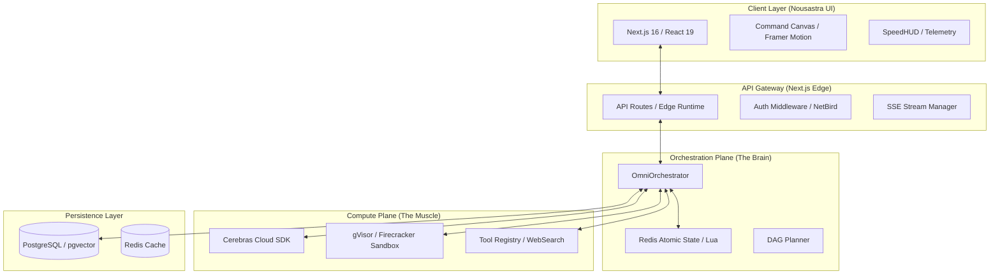

# OmniSwarm PROv1: Final Architecture Build Contract (v2)

This document serves as the **Locked Build Contract**. Every implementer must follow these interfaces, sequence flows, and build orders. No deviations are permitted without a signed-off ADR.

## 1. Problem Statement
The current OmniSwarm is a linear prototype. To reach **PROv1**, it must transition from a "scripted pipeline" to a **Distributed Agentic OS**. The system must handle hyper-velocity token streams (3000+ tok/s), maintain atomic state across a distributed DAG of agents, execute untrusted code in hardened sandboxes, and provide a "Glass-OS" UI that visualizes the swarm's velocity in real-time.

---

## 2. High-Level Design (HLD)

### System Component Diagram


### Core Data Flow: The Swarm Lifecycle
1. **Initiation**: User submits prompt $\rightarrow$ `Gateway` $\rightarrow$ `Orchestrator`.
2. **Planning**: `Orchestrator` calls Cerebras to generate a JSON DAG $\rightarrow$ Persisted to `Redis` as the "Source of Truth".
3. **Execution**: `Orchestrator` identifies "Ready" nodes (0 dependencies) $\rightarrow$ Dispatches to `Cerebras` (Reasoning) or `Sandbox` (Execution).
4. **Atomic Update**: Upon node completion, a **Lua script** updates the state in Redis and triggers the next set of dependent nodes.
5. **Streaming**: Every state change and token chunk is pushed via **SSE** to the `Command Canvas`.

---

## 3. Low-Level Design (LLD)

### A. Data Models (TypeScript)
`lib/core/types.ts`
```typescript
export type NodeStatus = 'pending' | 'running' | 'completed' | 'failed' | 'compromised';

export interface SwarmNode {
  id: string;
  type: 'reasoning' | 'execution';
  goal: string;
  dependsOn: string[];
  model?: string; // e.g., 'llama3.1-70b'
}

export interface NodeState {
  status: NodeStatus;
  output?: string;
  startTime?: number;
  endTime?: number;
  tokensPerSec?: number;
}

export interface SwarmState {
  runId: string;
  status: 'executing' | 'completed' | 'failed' | 'compromised';
  nodes: Record<string, NodeState>;
  finalArtifact?: string;
}
```

### B. API Surface (The Contract)
| Endpoint | Method | Payload | Response | Description |
| :--- | :--- | :--- | :--- | :--- |
| `/api/swarm/run` | `POST` | `{ prompt: string, templateId?: string }` | `{ runId: string }` | Initiates the DAG and returns a tracking ID. |
| `/api/swarm/stream` | `GET` | `?runId={id}` | `text/event-stream` | Streams node transitions and token chunks. |
| `/api/swarm/state` | `GET` | `?runId={id}` | `SwarmState` | Returns current snapshot of the DAG. |
| `/api/swarm/cancel` | `POST` | `{ runId: string }` | `{ status: 'terminated' }` | Kills all active sandboxes and marks run as failed. |

### C. The Atomic State Engine (Lua)
To prevent race conditions in a parallel swarm, all state transitions MUST use this Lua pattern in Redis:
```lua
-- update_node_status.lua
local state = cjson.decode(redis.call('get', KEYS[1]))
state.nodes[ARGV[1]].status = ARGV[2]
if ARGV[3] then
    state.nodes[ARGV[1]].output = ARGV[3]
end
redis.call('set', KEYS[1], cjson.encode(state))
return cjson.encode(state)
```

---

## 4. Scaling Strategy & Capacity

### Scaling
- **Orchestration**: Stateless. Scale horizontally via K8s.
- **State**: Redis Cluster with read-replicas for the `/state` endpoint.
- **Compute**: 
    - **Reasoning**: Offloaded to Cerebras (External).
    - **Execution**: Sandbox pool (Firecracker) scaled based on `pending` node queue depth.

### Capacity Estimates (Per 1k Concurrent Runs)
- **Redis Memory**: $\sim 2\text{GB}$ (Assuming 10 nodes/run, 10KB state/node).
- **PostgreSQL**: $\sim 50\text{GB}$/month (Run history + Vector embeddings).
- **Network**: $\sim 1\text{Gbps}$ egress for SSE streams.

---

## 5. Failure Modes & Mitigations

| Failure | Impact | Mitigation |
| :--- | :--- | :--- |
| **Cerebras Timeout** | Node hangs $\rightarrow$ DAG stalls. | Exponential backoff $\rightarrow$ Fail node $\rightarrow$ Trigger "Recovery Node" or mark run as `failed`. |
| **Sandbox Escape** | Host compromise. | gVisor/Firecracker isolation + No-Network egress by default + Read-only root FS. |
| **Redis Partition** | State inconsistency. | Use Redis Sentinel/Cluster; implement client-side idempotency keys for `dispatchNode`. |
| **SSE Disconnect** | UI loses sync. | Client sends `Last-Event-ID`; Server replays missed events from Redis log. |

---

## 6. Build Order (The Implementation Roadmap)

**Phase 1: The Foundation (Week 1)**
1. `lib/utils/logger.ts` $\rightarrow$ Standardized logging.
2. `lib/core/types.ts` $\rightarrow$ Locked interfaces.
3. `lib/core/persistence.ts` $\rightarrow$ PostgreSQL schema for `runs` and `events`.

**Phase 2: The Brain (Week 2)**
1. `lib/core/orchestrator.ts` $\rightarrow$ Implement `triggerSwarm` and `dispatchNode`.
2. Redis Lua scripts $\rightarrow$ Implement atomic state transitions.
3. `api/swarm/run` $\rightarrow$ Integration of Planner $\rightarrow$ Orchestrator.

**Phase 3: The Muscle (Week 3)**
1. `lib/core/sandbox-manager.ts` $\rightarrow$ gVisor/Firecracker integration.
2. `lib/core/tool-registry.ts` $\rightarrow$ WebSearch and File I/O tools.
3. `api/swarm/stream` $\rightarrow$ SSE implementation for real-time telemetry.

**Phase 4: The Experience (Week 4)**
1. `components/CommandCanvas.tsx` $\rightarrow$ Framer Motion DAG visualization.
2. `components/SpeedHUD.tsx` $\rightarrow$ Real-time TPS/TTFT display.
3. End-to-end "Race Mode" stress test.

---

## 7. Open Questions
1. **Multi-Tenancy**: Should we implement hard-isolation at the DB level (Schema-per-user) or soft-isolation (UserID column)? $\rightarrow$ *Decision: Soft-isolation for PROv1, migrate to hard for Enterprise.*
2. **Tombstone Verification**: How aggressive should the "Delete Data" verification be? $\rightarrow$ *Decision: Implement a 404-check on the internal storage API.*