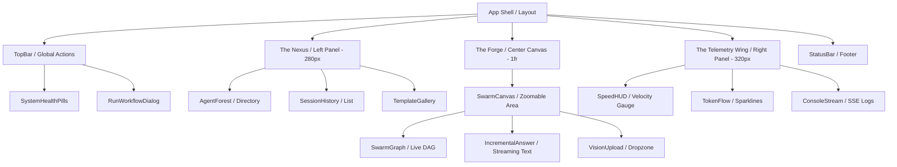

<thinking>
The objective is to provide a production-grade UI architecture for **OmniSwarm PROv1**, merging the high-performance capabilities of Cerebras with the "Agentic OS" aesthetic of Nousastra.

**Architectural Constraints:**
1. **Velocity as a Primitive**: The UI must visualize 3000+ tok/s. Standard streaming is insufficient; we need "velocity primitives" (glow pulses, particle flows).
2. **Obsidian Glass Aesthetic**: Transition from `zinc-950` to a layered, translucent obsidian system using OKLCH for perceptual uniformity.
3. **Triptych Layout**: A Command Center approach (Nexus $\rightarrow$ Forge $\rightarrow$ Telemetry).
4. **State-Driven Motion**: Use `motion/react` for DAG transitions and HUD updates.

**Component Analysis:**
- Existing `SpeedHUD.tsx` is a basic grid. It needs to be evolved into a high-fidelity telemetry wing.
- `AgentForest` (from memory context) needs to be integrated as the "Nexus" agent directory.
- The "Forge" (Center) requires a new `SwarmCanvas` that merges the DAG visualizer with the incremental answer stream.

**Technical Strategy:**
- **Theme**: CSS-first tokens using Tailwind v4 `@theme` and OKLCH.
- **Performance**: Code-splitting by route; SSE multiplexing for real-time updates.
- **A11y**: WCAG 2.1 AA compliance, focusing on keyboard navigation for the DAG and high-contrast telemetry.
</thinking>

# OmniSwarm PROv1: UI Architecture Specification

## 1. Component Hierarchy (The Command Center)

The UI is structured as a **Triptych Layout**, separating navigation, execution, and telemetry into three distinct functional zones.



---

## 2. Theme System: "Obsidian Glass"

We move from flat colors to a layered, translucent system. We use **OKLCH** to ensure neon accents remain vibrant without shifting hue.

### `src/styles/tokens.css`
```css
@import "tailwindcss";
@import "tw-animate-css";

:root {
  /* --- Obsidian Base (Layered Depth) --- */
  --bg-obsidian: oklch(0.12 0.01 260);             /* Deepest background */
  --panel-obsidian: oklch(0.18 0.02 260 / 60%);    /* Glass panels */
  --surface-obsidian: oklch(0.22 0.02 260 / 40%);  /* Inner surfaces */
  --border-obsidian: oklch(0.25 0.02 260 / 30%);   /* Subtle edges */
  
  /* --- Hyper-Velocity Accents (OKLCH) --- */
  --accent-logic: oklch(0.65 0.22 260);            /* Electric Indigo */
  --accent-success: oklch(0.75 0.18 150);          /* Neon Emerald */
  --accent-warning: oklch(0.80 0.15 85);           /* Cyber Amber */
  --accent-error: oklch(0.60 0.20 25);             /* Plasma Red */
  
  /* --- Glows --- */
  --glow-logic: 0 0 20px oklch(0.65 0.22 260 / 30%);
  --glow-success: 0 0 20px oklch(0.75 0.18 150 / 30%);

  /* --- Typography --- */
  --font-sans: 'Inter', system-ui, sans-serif;
  --font-mono: 'JetBrains Mono', monospace;
}

@theme inline {
  --color-obsidian-bg: var(--bg-obsidian);
  --color-obsidian-panel: var(--panel-obsidian);
  --color-obsidian-border: var(--border-obsidian);
  --color-accent-logic: var(--accent-logic);
  --color-accent-success: var(--accent-success);
  
  --shadow-glow-logic: var(--glow-logic);
  
  --animate-flow: flow 2s linear infinite;
  @keyframes flow {
    from { stroke-dashoffset: 20; }
    to { stroke-dashoffset: 0; }
  }
}
```

---

## 3. Animation & Motion Spec

To visualize 3000 tok/s, we avoid linear transitions and use **Spring Physics** and **High-Frequency Pulses**.

| Element | Trigger | Motion Type | Config |
| :--- | :--- | :--- | :--- |
| **Node Spawn** | Agent Dispatch | Scale-in + Fade | `type: "spring", stiffness: 300, damping: 20` |
| **Token Flow** | SSE Chunk | SVG Dash-offset | `linear`, 2s loop, `stroke-dasharray: 4 2` |
| **HUD Gauge** | TPS Update | Arc-fill | `type: "spring", stiffness: 100, damping: 15` |
| **Answer Stream** | Text Append | Opacity + Y-offset | `duration: 0.1s`, `ease: "easeOut"` |
| **Panel Switch** | Tab Change | Layout Morph | `layoutId` shared element transition |

---

## 4. Production Implementation

### `src/components/ui/SpeedHUD.tsx`
Evolving the existing `SpeedHUD` into a high-fidelity telemetry gauge.

```tsx
"use client";

import React from "react";
import { motion } from "motion/react";
import { Activity, Zap } from "lucide-react";

interface TelemetryProps {
  tps: number;
  ttft: number;
  isActive: boolean;
}

export const SpeedHUD: React.FC<TelemetryProps> = ({ tps, ttft, isActive }) => {
  const velocityColor = tps > 2000 ? "text-accent-success" : "text-accent-logic";
  const strokeColor = tps > 2000 ? "stroke-accent-success" : "stroke-accent-logic";

  return (
    <div className="p-6 rounded-2xl bg-obsidian-panel border border-obsidian-border backdrop-blur-xl flex flex-col gap-6">
      <div className="flex items-center justify-between">
        <h3 className="text-xs font-mono uppercase tracking-widest text-zinc-500 flex items-center gap-2">
          <Activity size={14} /> Velocity Telemetry
        </h3>
        {isActive && <span className="h-2 w-2 rounded-full bg-accent-success animate-pulse" />}
      </div>

      <div className="relative flex flex-col items-center justify-center py-4">
        <svg className="w-40 h-40 transform -rotate-90">
          <circle cx="80" cy="80" r="70" className="stroke-obsidian-border fill-none" strokeWidth="12" />
          <motion.circle 
            cx="80" cy="80" r="70" 
            className={`fill-none ${strokeColor}`} 
            strokeWidth="12" 
            strokeLinecap="round"
            initial={{ strokeDasharray: "0 440" }}
            animate={{ strokeDasharray: `${(tps / 3000) * 440} 440` }}
            transition={{ type: "spring", stiffness: 60, damping: 12 }}
          />
        </svg>
        <div className="absolute inset-0 flex flex-col items-center justify-center">
          <motion.span 
            key={tps}
            initial={{ opacity: 0.8, scale: 0.95 }}
            animate={{ opacity: 1, scale: 1 }}
            className={`text-4xl font-mono font-bold ${velocityColor}`}
          >
            {tps.toLocaleString()}
          </motion.span>
          <span className="text-[10px] font-mono text-zinc-500 uppercase">tok/s</span>
        </div>
      </div>

      <div className="grid grid-cols-2 gap-3">
        <div className="p-3 rounded-lg bg-obsidian-surface border border-obsidian-border">
          <span className="text-[10px] font-mono text-zinc-500 block">TTFT</span>
          <span className="text-sm font-mono font-medium text-zinc-200">{ttft}ms</span>
        </div>
        <div className="p-3 rounded-lg bg-obsidian-surface border border-obsidian-border">
          <span className="text-[10px] font-mono text-zinc-500 block">Latency</span>
          <span className="text-sm font-mono font-medium text-zinc-200">~{Math.round(ttft/10)}ms</span>
        </div>
      </div>
    </div>
  );
};
```

### `src/components/ui/SwarmCanvas.tsx`
The central orchestration surface.

```tsx
"use client";

import React, { useState } from "react";
import { motion, AnimatePresence } from "motion/react";
import { SwarmGraph } from "./SwarmGraph";
import { IncrementalAnswer } from "./IncrementalAnswer";
import { VisionUpload } from "./VisionUpload";

export const SwarmCanvas = () => {
  const [viewMode, setViewMode] = useState<'graph' | 'answer'>('graph');

  return (
    <div className="relative w-full h-full overflow-hidden bg-obsidian-bg">
      {/* Mode Toggle */}
      <div className="absolute top-6 left-1/2 -translate-x-1/2 z-50 p-1 bg-obsidian-panel border border-obsidian-border rounded-full flex gap-1">
        <button 
          onClick={() => setViewMode('graph')}
          className={`px-4 py-1 rounded-full text-xs font-mono transition-all ${viewMode === 'graph' ? 'bg-accent-logic text-white' : 'text-zinc-400'}`}
        >
          Swarm Graph
        </button>
        <button 
          onClick={() => setViewMode('answer')}
          className={`px-4 py-1 rounded-full text-xs font-mono transition-all ${viewMode === 'answer' ? 'bg-accent-logic text-white' : 'text-zinc-400'}`}
        >
          Final Artifact
        </button>
      </div>

      <AnimatePresence mode="wait">
        {viewMode === 'graph' ? (
          <motion.div 
            key="graph"
            initial={{ opacity: 0, scale: 0.98 }}
            animate={{ opacity: 1, scale: 1 }}
            exit={{ opacity: 0, scale: 1.02 }}
            className="w-full h-full"
          >
            <SwarmGraph />
          </motion.div>
        ) : (
          <motion.div 
            key="answer"
            initial={{ opacity: 0, y: 20 }}
            animate={{ opacity: 1, y: 0 }}
            exit={{ opacity: 0, y: -20 }}
            className="w-full h-full p-12 overflow-y-auto"
          >
            <IncrementalAnswer />
          </motion.div>
        )}
      </AnimatePresence>

      <div className="absolute bottom-8 right-8">
        <VisionUpload />
      </div>
    </div>
  );
};
```

---

## 5. Technical Specs & Performance

### File Structure
```text
src/
  ├── styles/
  │   └── tokens.css          # OKLCH Design Tokens
  ├── components/
  │   ├── ui/
  │   │   ├── SpeedHUD.tsx    # High-fidelity telemetry
  │   │   ├── SwarmCanvas.tsx # Main Forge shell
  │   │   ├── SwarmGraph.tsx  # SVG DAG Visualizer
  │   │   ├── IncrementalAnswer.tsx # Streaming text
  │   │   └── VisionUpload.tsx # Multimodal dropzone
  │   └── layout/
  │       ├── Nexus.tsx       # Left Navigation
  │       └── TelemetryWing.tsx # Right Panel
  └── hooks/
      └── useSwarmStream.ts   # SSE Multiplexer hook
```

### Code Splitting & Render Strategy
1. **Route-Level Splitting**: Use `React.lazy` for `AgentForest` and `ConsoleStream` to keep the initial bundle under 150KB.
2. **SSE Multiplexing**: A single `EventSource` connection to `/api/swarm/stream` that dispatches events to a global `SwarmContext` to prevent multiple socket connections.
3. **Canvas Rendering**: `SwarmGraph` uses SVG for nodes/edges to ensure crispness at any zoom level, while `IncrementalAnswer` uses a virtualized list for extremely long outputs.
4. **GPU Acceleration**: All `motion.div` elements use `transform` and `opacity` to ensure 60fps animations during high-velocity token streams.