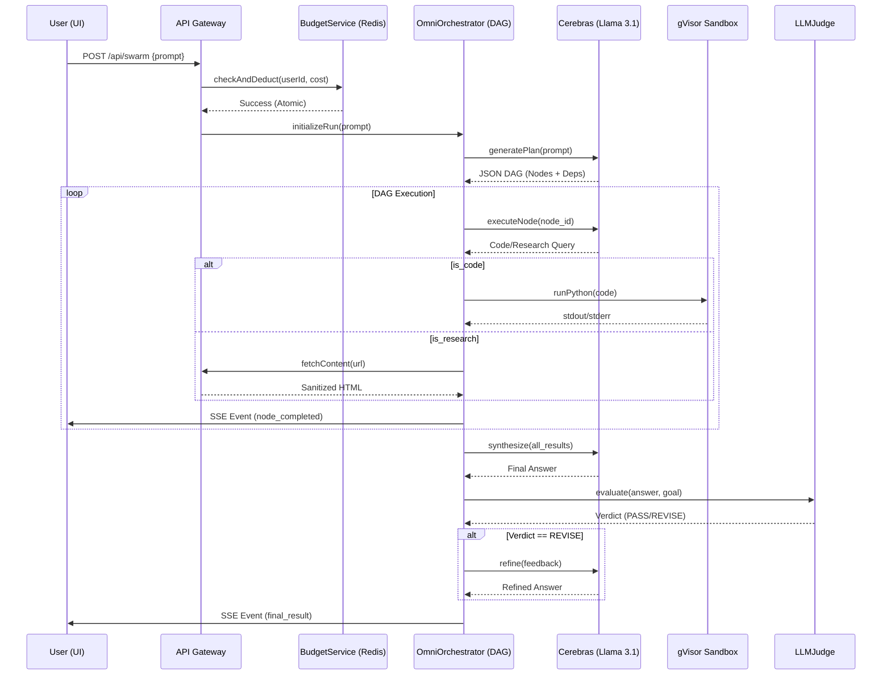

As Tech Lead, I have synthesized the previous audit, architectural decisions, and security remediations into a final **PROv1 Integration Build Plan**. 

The goal is to move from a collection of "fixed" modules to a coherent, production-grade **Agentic OS**. We are shifting from a linear pipeline to a **DAG-based Orchestrator** with a **Triptych "Obsidian Glass" UI**, backed by a **gVisor-hardened sandbox**.

### 1. Engineering Work Packages (WPs)

| WP ID | Title | Description | Acceptance Criteria | Est. | Deps |
| :--- | :--- | :--- | :--- | :--- | :--- |
| **WP-1** | **Core DAG Engine** | Implement `OmniOrchestrator` using Kahn's Algorithm for cycle detection and parallel node execution. | 1. Validates DAG before run. 2. Executes independent nodes in parallel. 3. Correctly propagates outputs to dependent nodes. | 5d | None |
| **WP-2** | **Hardened Runtime** | Deploy the `SandboxManager` using `runsc` (gVisor) with `--net=none` and read-only FS. | 1. Python code executes in isolation. 2. Network requests from sandbox fail. 3. Host filesystem is inaccessible. | 3d | None |
| **WP-3** | **Secure Data Layer** | Integrate `ResearchFetcher` (Anti-SSRF) and `BudgetService` (Atomic Lua) into the API flow. | 1. Private IP ranges blocked. 2. Budget deduction is atomic (no race conditions). 3. DNS rebinding prevented. | 3d | None |
| **WP-4** | **Triptych UI Shell** | Implement the `CommandCenter` layout with `NexusPanel` and `TelemetryWing` using OKLCH tokens. | 1. Layout is responsive and non-overlapping. 2. Glassmorphism effects active. 3. Sidebar/Wing state persists across views. | 4d | None |
| **WP-5** | **Velocity Streamer** | Implement `useSwarmStream` with `requestAnimationFrame` to handle 3000+ tok/s without UI lag. | 1. DOM updates capped at 60fps. 2. No "stutter" during high-velocity bursts. 3. Memory leak-free stream termination. | 3d | WP-4 |
| **WP-6** | **End-to-End Wiring** | Connect the `OmniOrchestrator` SSE stream to the `StreamingAnswer` component via the API route. | 1. User prompt $\rightarrow$ DAG $\rightarrow$ Sandbox $\rightarrow$ UI. 2. Real-time telemetry (TPS/TTFT) updates in `SpeedHUD`. | 4d | WP-1,2,3,4,5 |
| **WP-7** | **Judge-Critic Loop** | Integrate `LLMJudge` to evaluate synthesis and trigger `REVISE` loops if rubric scores are low. | 1. Synthesis is audited against goal. 2. Automatic re-run of failed nodes. 3. Final verdict included in output. | 3d | WP-1, WP-6 |

---

### 2. System Sequence Diagram: The PROv1 Path

This diagram illustrates the "Smoke Path" from user input to the final high-velocity synthesis.

---

### 3. Risk Register & Mitigation

| Risk | Impact | Probability | Mitigation Strategy |
| :--- | :--- | :--- | :--- |
| **DOM Bottleneck** | High | High | Use the `StreamingBuffer` (WP-5) to decouple LLM token speed from React render cycles. |
| **Sandbox Overhead** | Medium | Medium | Implement a warm-pool of gVisor containers to reduce `docker run` cold-start latency. |
| **DAG Deadlock** | High | Low | Mandatory Kahn's Algorithm check (WP-1) to reject any plan containing cycles before execution. |
| **Cerebras Rate Limit** | Medium | Medium | Implement a priority queue in the `OmniOrchestrator` to throttle low-priority tasks during peak load. |
| **Prompt Injection** | High | Medium | Enforce structural XML delimiters and the "Data-Only" system prompt in the `PromptSanitizer`. |

### 4. Execution Sequence
To minimize blocking, the team will execute in three parallel tracks:
1. **Track A (Infrastructure)**: WP-2 $\rightarrow$ WP-3 $\rightarrow$ WP-1.
2. **Track B (Experience)**: WP-4 $\rightarrow$ WP-5.
3. **Track C (Integration)**: WP-6 $\rightarrow$ WP-7.

**Critical Path**: `WP-1` $\rightarrow$ `WP-6` $\rightarrow$ `WP-7`.